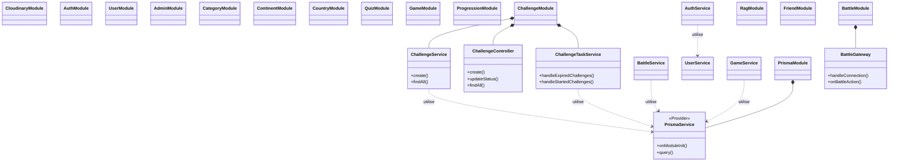

# Diagramme d'Architecture de Code (NestJS)

Ce diagramme représente l'organisation des modules, services et contrôleurs du projet.

### Couches de l'Architecture :

1.  **Controllers** : Gèrent les requêtes HTTP et renvoient les réponses.
2.  **Services** : Contiennent la logique métier (calculs, règles, validation complexe).
3.  **Gateways** : Gèrent les communications en temps réel via WebSockets (Socket.io).
4.  **Providers** : Fournissent des fonctionnalités globales (Accès base de données, Upload Cloudinary).
5.  **Modules** : Encapsulent et organisent les fonctionnalités par domaine.
